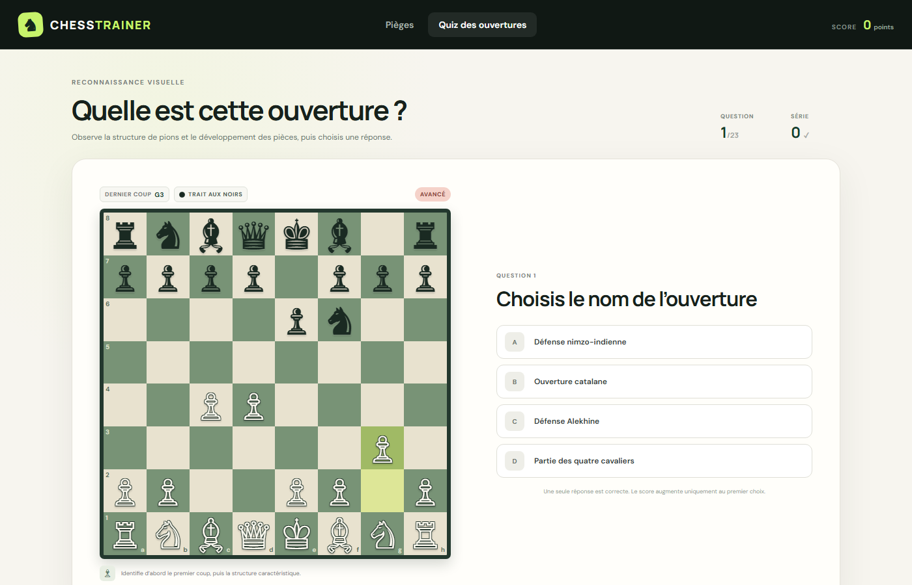
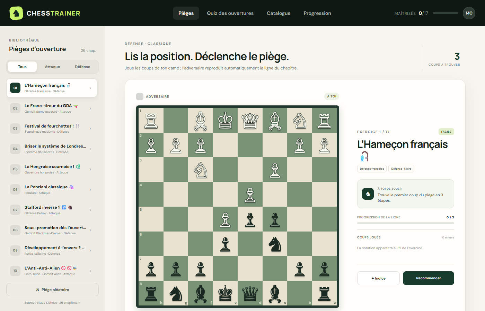

# ♞ ChessTrainer

> **Application web interactive d'entraînement aux échecs : mémorisation visuelle des ouvertures et maîtrise des pièges tactiques.**

[](https://dotnet.microsoft.com/)
[](https://dotnet.microsoft.com/apps/aspnet/web-apps/blazor)
[](https://learn.microsoft.com/dotnet/csharp/)
[](LICENSE)

---

## 📸 Aperçu du Quiz des ouvertures

Le module de **Quiz des ouvertures** met à l'épreuve votre sens de l'observation et votre culture échiquéenne en vous présentant des positions issues des premiers coups théoriques :



---

## 🎯 Ce que fait cette solution

**ChessTrainer** est conçu pour aider les joueurs d'échecs de tous niveaux à affûter leur vision de jeu au début de partie à travers deux modes d'apprentissage complémentaires :

### 1. 🧩 Le Quiz de reconnaissance visuelle (`/quiz`)
- **Apprentissage par l'image** : visualisez l'échiquier après les premiers coups clés, observez la structure de pions et le déploiement des pièces.
- **Catalogue progressif (23 questions)** réparties en 3 niveaux de difficulté :
  - 🟢 **Débutant** : *Partie italienne, Partie espagnole, Partie viennoise, Défense Petrov, Partie écossaise, Système de Londres, 4 Cavaliers...*
  - 🟡 **Intermédiaire** : *Défense Caro-Kann, Défense Alekhine, Défense Grünfeld, Gambit du roi, Gambit Benko, Sicilienne Dragon, Défense hollandaise, Défense française...*
  - 🔴 **Avancé** : *Défense est-indienne, Nimzo-indienne, Ouverture catalane, Défense slave, Gambit dame refusé/accepté, Sicilienne Najdorf, Scandinave...*
- **QCM dynamique** : 4 choix proposés avec feedback immédiat (bonne réponse mise en évidence, explication stratégique).
- **Gamification & Statistiques** : calcul du score en direct, décompte de séries de victoires (*streak*) et écran récapitulatif en fin de session.

---

### 2. ⚡ L'Entraîneur de pièges d'ouverture (`/`)
- **Mise en situation réelle** : jouez les coups clés de votre camp contre les répliques automatiques de l'adversaire.
- **26 chapitres & 17 exercices interactifs** inspirés des études pédagogiques de Lichess.
- **Filtres stratégiques** : triez les exercices par posture (*Tous*, *Attaque*, *Défense*).
- **Aide et progression** : indices tactiques contextuels, notation algébrique des coups, détection d'erreurs et sauvegarde de la maîtrise des lignes.

---

### 3. 🎯 L'Entraînement aux coordonnées (`/coordonnees`)
- **Repérage spatial interactif** : trouvez le plus rapidement possible la case demandée (ex: *C4*, *E4*, *A1*).
- **Niveaux d'assistance gradués** :
  - 🟢 **Très Facile** : affichage de toutes les coordonnées sur chaque case.
  - 🟢 **Facile** : affichage de la coordonnée uniquement sur la case cible à cliquer.
  - 🟡 **Moyen** : affichage des lettres en bas et des chiffres à droite en petit format.
  - 🔴 **Difficile** : échiquier nu (aucune coordonnée affichée).
- **Orientation du plateau** : basculement vue des Blancs ou vue des Noirs (inversé).
- **Modes de jeu** : entraînement continu ou défi chrono de 30 secondes avec statistiques (score, série, record, précision).



---

## 🛠️ Pile technique & Architecture

- **Framework** : ASP.NET Core Blazor (.NET 10) en mode **Interactive Server** (communication réactive temps réel via SignalR).
- **Moteur d'échecs interne** :
  - `BoardState.cs` : gestion autonome de l'état de l'échiquier en C# pur (représentation des pièces, cases, coordonnées et parsing FEN/coups algébriques).
  - Aucune dépendance externe lourde requise.
- **Interface & Composants Razor** :
  - `PositionBoard.razor` : composant léger de rendu vectoriel (SVG) pour les positions statiques et questions du quiz.
  - `ChessBoard.razor` : échiquier interactif complet gérant le drag-and-drop, les sélections de cases et l'animation des coups.
  - Responsive design pensé pour écrans d'ordinateurs et smartphones.
- **Services** :
  - `OpeningQuizCatalog.cs` : banque de questions et d'explications sur les ouvertures.
  - `TrainerCatalog.cs` : catalogue d'exercices tactiques et de pièges.

---

## 🚀 Démarrage rapide

### Prérequis
- [.NET 10 SDK](https://dotnet.microsoft.com/download) installé sur votre machine.

### Installation et exécution

1. **Cloner le dépôt** :
   ```bash
   git clone https://github.com/chouteau/chesstrainer.git
   cd chesstrainer
   ```

2. **Lancer l'application** :
   ```bash
   dotnet run --project src/ChessTrainer/ChessTrainer.csproj
   ```

3. **Accéder à l'interface** :
   Ouvrez votre navigateur web sur :
   - 🏠 **Pièges d'ouverture** : `http://localhost:5215` (ou port affiché dans la console)
   - ♟️ **Quiz des ouvertures** : `http://localhost:5215/quiz`
   - 🎯 **Entraînement aux coordonnées** : `http://localhost:5215/coordonnees`

---

## 🐳 Utilisation avec Docker

L'application est disponible sous forme d'image de conteneur optimisée et sécurisée basée sur **Ubuntu Chiseled** (.NET 10).

### 1. Exécuter l'image depuis GitHub Container Registry (GHCR)

Pour lancer directement la dernière version de production hébergée sur GitHub :

```bash
docker run -d -p 8080:8080 --name chesstrainer ghcr.io/chouteau/chesstrainer:latest
```

L'application est alors accessible sur `http://localhost:8080`.

### 2. Construire et exécuter l'image localement

Si vous préférez builder l'image vous-même :

```bash
# Construction de l'image
docker build -t chesstrainer:local .

# Lancement du conteneur
docker run -d -p 8080:8080 --name chesstrainer chesstrainer:local
```

### 3. Déploiement en production avec Docker Compose (Traefik & Arcane)

Un fichier [`docker-compose.prod.yml`](docker-compose.prod.yml) est préconfiguré pour un déploiement sur VPS via l'orchestrateur **Arcane** derrière un reverse proxy **Traefik** avec redirection automatique HTTP vers HTTPS et certificat SSL Let's Encrypt :

```bash
docker compose -f docker-compose.prod.yml up -d
```

L'application sera automatiquement exposée et sécurisée sur votre nom de domaine configuré (`https://chesstrainer.chouteau.info`).

---

## 📜 Licence

Ce projet est sous licence MIT. Consultez le fichier [LICENSE](LICENSE) pour plus de détails.
